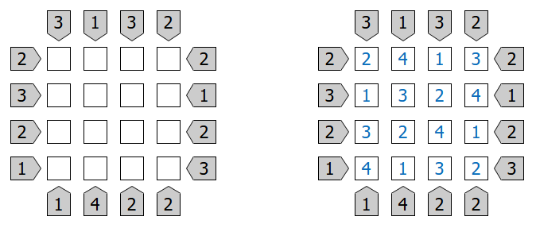
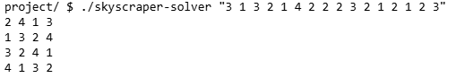

# Skyscraper solver

This code solves the skyscraper puzzle using a backtracking algorithm <br />

## What is a skyscraper puzzle?
The skyscraper puzzle is a logic-based game that involves placing skyscrapers of different heights in a grid. The goal is to correctly position the skyscrapers in a way that satisfies specific rules about visibility and arrangement.<br />
* The grid is square, typically ranging from 4x4 to NxN
* The number of skyscrapers corresponds to the size of the grid
* Each number in the puzzle corresponds to the height of a skyscraper
* Clues are provided along the edges of the grid, indicating how many skyscrapers are visible from that particular viewpoint
* Visibility means that taller buildings block the view of shorter buildings behind them
* No two skyscrapers of the same height can be placed in the same row or column (no duplicates)

The objective is to place the skyscrapers in the grid so that all the conditions are met: 
* Each row and column contains a unique set of heights (1 through N)
* The visibility clues for each row and column are satisfied
<br />

<p align="center">
  <br />
  <small>This is an example of an empty board and its solution</small>
</p>
<br />

## Approach to solve the puzzle
The puzzle is solved using a **Backtracking Algorithm**, which systematically explores all possible configurations of skyscrapers while checking if the placement satisfies the visibility and uniqueness constraints.<br />

**Steps**
1. Start with an empty grid
2. Place skyscrapers one by one: for each cell in the grid, attempt to place a skyscraper and check whether the placement satisfies the rules (visibility and uniqueness)
3. Move to the next cell if the placement is valid
4. Backtrack if a placement is invalid by removing the most recently placed skyscraper and trying a different option
5. Repeat this process until the grid is filled or all possibilities are exhausted
<br />

## Executing the code
**Choose board size**<br />
You can change the board size by modifying the variable `N` inside the `include/header.h` file. The default value is set to 4. For example, to change the grid size to 5x5, modify the N value as follows:
```c
# define N 5
```
<br />

**Compile the program**<br />
Use the `make` command to compile the source code and generate the binary `skyscraper-solver`. Open a terminal, navigate to the project directory, and run:
```c
make
```
<br />

**Run the program**<br />
To run the program, there must be one argument in the command-line. The argument must be a string containing all constraints needed to solve the puzzle.<br />
The format for the input string is:
```c
./skyscraper-solver "col1up ... colNup col1down ... colNdown row1left ... rowNleft row1right ... rowNright"
```
  - `colNup` corresponds to the constraint for the viewpoint of the top of the Nth column
  - `colNdown` corresponds to the constraint for the viewpoint from the bottom of the Nth column
  - `rowNleft` corresponds to the constraint for the viewpoint from the left of the Nth row
  - `rowNright` corresponds to the constraint for the viewpoint from the right of the Nth row
<br />

**Output**<br />
The program will output the solution to the puzzle in the following format:
<p>
  <br />
  <small>The input and output of the program</small>
</p>
